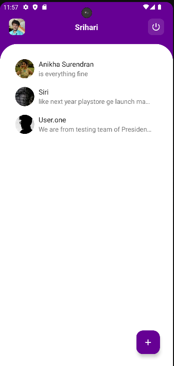
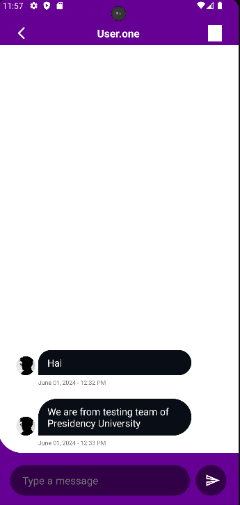
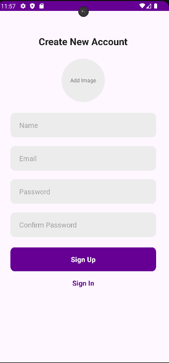

# ChatNova - Android App

ChatNova is an advanced Android application designed to provide seamless and efficient communication. It leverages modern technologies to offer a robust and user-friendly messaging experience.

## Features

- **Instant Messaging:** Real-time text messaging with friends and family.
- **Multimedia Sharing:** Share photos, videos, and other multimedia files.
- **User Authentication:** Secure login and registration using Firebase Authentication.
- **Push Notifications:** Stay updated with instant notifications for new messages.
- **Group Chats:** Create and manage group conversations.
- **Profile Customization:** Personalize your profile with custom avatars and status updates.
- **End-to-End Encryption:** Secure your conversations with end-to-end encryption.

## Tech Stack

- **Android SDK:** Application development
- **Java/Kotlin:** Core programming languages
- **Firebase Authentication:** User authentication and management
- **Firebase Firestore:** Real-time database for storing and syncing data
- **Firebase Cloud Messaging (FCM):** Push notifications
- **Glide:** Image loading and caching
- **Material Design:** UI components and design guidelines

## Screenshots

Here are some screenshots of the ChatNova app:

### Home Screen


### Chat Screen


### Profile Screen


## Getting Started

### Prerequisites

- Android Studio installed on your development machine
- A Firebase project set up with Authentication, Firestore, and FCM

### Installation

1. Clone the repository:
    ```bash
    git clone https://github.com/srihari-976/ChatNova---AndriodApp.git
    cd ChatNova---AndriodApp
    ```

2. Open the project in Android Studio.

3. Set up Firebase:
    - Add your `google-services.json` file to the `app` directory.
    - Configure Firebase Authentication, Firestore, and FCM in the Firebase console.

4. Build and run the project on your emulator or physical device.

### APK Download

You can download the built APK file from the [app/build](https://github.com/srihari-976/ChatNova---AndriodApp/tree/main/app/build) directory.

## Usage

1. **Sign Up/Log In:**
    - Register a new account or log in with your existing credentials.

2. **Start Chatting:**
    - Begin a new conversation by selecting a contact or creating a new group chat.

3. **Send Messages:**
    - Send text messages, photos, videos, and other multimedia files.

4. **Receive Notifications:**
    - Get notified instantly when you receive new messages.

## Contributing

We welcome contributions to enhance ChatNova! To contribute, follow these steps:

1. Fork the repository.
2. Create a new branch: `git checkout -b feature/YourFeatureName`
3. Make your changes and commit them: `git commit -m 'Add some feature'`
4. Push to the branch: `git push origin feature/YourFeatureName`
5. Open a pull request.

## License

This project is licensed under the MIT License. See the [LICENSE](LICENSE) file for details.

## Contact

For questions, feedback, or suggestions, please contact:

- Srihari ([GitHub Profile](https://github.com/srihari-976))
